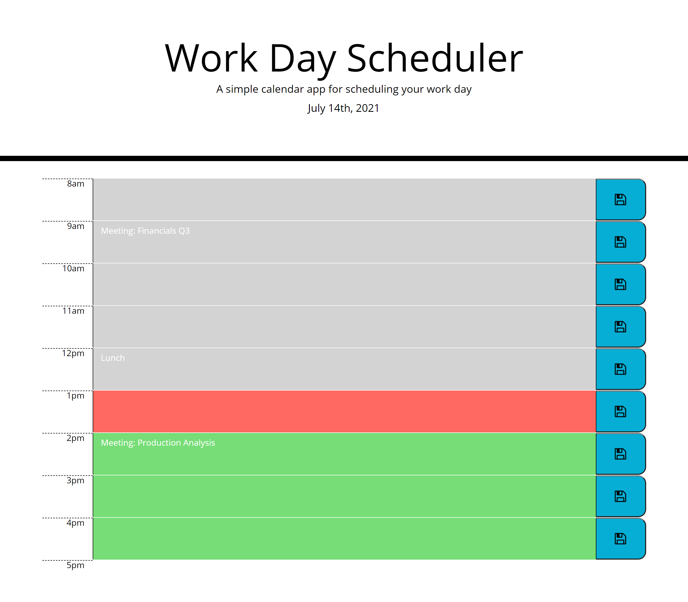

# UNC HW 5 - Work Day Scheduler

This application is a basic scheduler for a work day time frame. The title of the application and a short description are listed at the top of the page along with the current date.There are time slots starting at 8am and ending at 4pm to represent an 8am-5pm work day below. The time slots change color based on the time of day; the current time will be represented in red, upcoming time slots will be represented in green, past time slots will be represented in gray. The user can input text into the time slots and press a save button on the right of the time slot to save the text they input. Refreshing the page will not delete the text in the time slots, the text will be stored in local storage.

[Link to Live Application](https://likearollinson.github.io/unc-hw-5-work-day-scheduler/)

